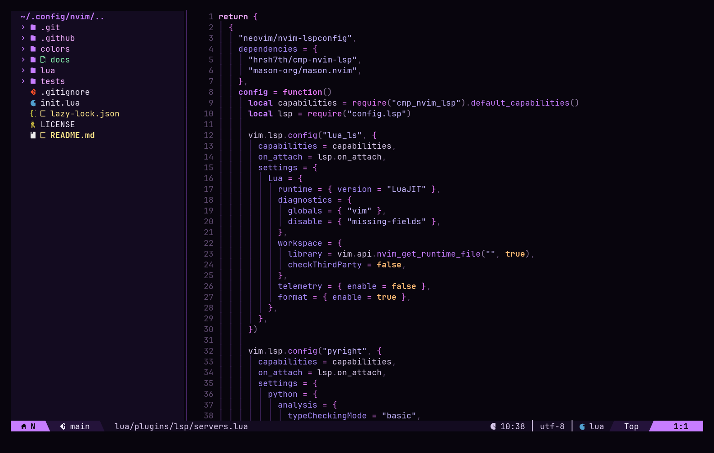
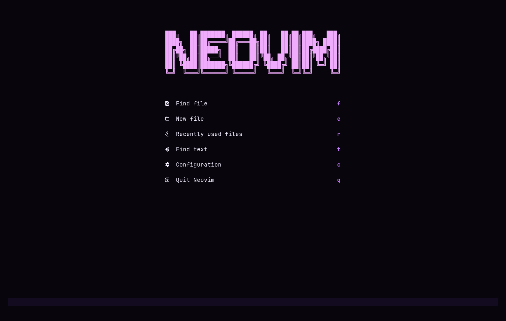
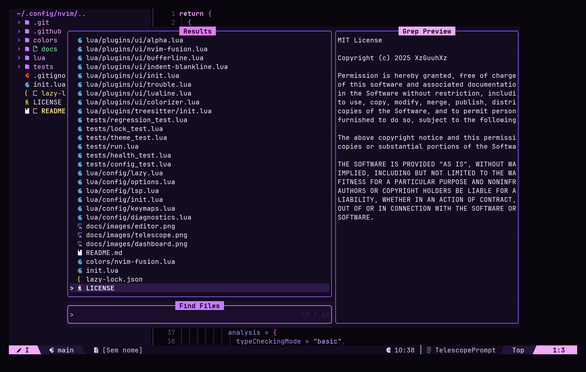

# NVIM FUSION 🚀

> Uma configuração modular, moderna e neon-cyberpunk para Neovim, focada em produtividade, LSP, navegação de código e uma identidade visual própria.

[](https://neovim.io/)
[](https://www.lua.org/)
[](https://github.com/XzGuuhXz/Nvim-Fusion/actions/workflows/nvim.yml)
[](LICENSE)
[](https://github.com/XzGuuhXz/Nvim-Fusion/commits/main)

## 📸 Visual do rice

### Editor



### Tela inicial



### Busca de arquivos



As imagens mostram a interface real da configuração, capturada pela API de UI do Neovim e renderizada com JetBrainsMono Nerd Font e fundo sólido `#08050D`. A transparência e o fundo podem variar conforme o terminal.

## ✨ Sobre

**NVIM FUSION** é uma configuração pessoal de Neovim transformada em um projeto aberto para quem quer um ambiente de desenvolvimento pronto, modular e fácil de modificar.

A configuração usa **Lazy.nvim**, **Mason**, **LSP**, **nvim-cmp**, **Treesitter**, **Telescope**, **NvimTree**, **Gitsigns** e uma identidade visual própria chamada **NVIM FUSION v2 Neon Cyberpunk**.

### Filosofia

- ⚡ Performance com carregamento lazy
- 🧩 Configuração modular por responsabilidade
- 🎨 Tema próprio em roxo, violeta, magenta e fúcsia
- 🧠 LSP e completion para desenvolvimento moderno
- 🌳 Treesitter para destaque e estrutura de código
- 🔎 Telescope para busca e navegação
- 🌲 NvimTree para exploração de arquivos
- 󰊢 Gitsigns para integração visual com Git
- 🔤 Nerd Font para uma interface rica em ícones

## 📦 Requisitos

| Requisito | Versão / observação |
|---|---|
| Neovim | **0.12+** |
| Git e acesso à rede | Necessários para Lazy.nvim, plugins, registry e downloads do Mason |
| Nerd Font | Recomendada para os ícones |
| ripgrep | Recomendado para buscas do Telescope |
| Node.js e npm | Necessários para Pyright, TypeScript, JSON, HTML e CSS via Mason |
| Python | Interpretador do projeto recomendado para análise com Pyright |
| Compilador C, `curl` e `tar` | Necessários para instalar parsers do Treesitter |
| clangd | Instalado via Mason; projetos C/C++ se beneficiam de `compile_commands.json` |
| tree-sitter CLI | **0.26.1+** para instalação/atualização dos parsers; não confundir com o plugin Neovim |

> O projeto usa APIs modernas do Neovim e a linha atual do nvim-treesitter. Versões antigas do Neovim não são suportadas.

## 🚀 Instalação

### 1. Faça backup da configuração atual

```bash
mv ~/.config/nvim ~/.config/nvim.backup-$(date +%Y%m%d-%H%M%S)
```

Se quiser preservar também dados e plugins anteriores:

```bash
mv ~/.local/share/nvim ~/.local/share/nvim.backup-$(date +%Y%m%d-%H%M%S)
```

### 2. Clone o NVIM FUSION

HTTPS:

```bash
git clone https://github.com/XzGuuhXz/Nvim-Fusion.git ~/.config/nvim
```

SSH:

```bash
git clone git@github.com:XzGuuhXz/Nvim-Fusion.git ~/.config/nvim
```

### 3. Inicie o Neovim

```bash
nvim
```

O bootstrap fixa o próprio Lazy.nvim no commit de `lazy-lock.json`; o Lazy instala os plugins e o Mason verifica os sete LSPs assim que a interface interativa é anexada. Mantenha o editor aberto até os downloads terminarem. Instalação de pacotes e conexão a um buffer são etapas distintas.

### 4. Verifique a instalação

Dentro do Neovim:

```vim
:checkhealth
:Lazy
:Mason
:checkhealth vim.lsp
```

Confira os sete pacotes instalados em `:Mason` e abra um arquivo de cada linguagem para verificar o cliente conectado com `:LspInfo` ou `:checkhealth vim.lsp`. Veja [instalação limpa e testes](#-testes) e [solução de problemas](docs/TROUBLESHOOTING.md).

## 🐧 Distribuições Linux

### Debian / Ubuntu

```bash
sudo apt update
sudo apt install git ripgrep fd-find nodejs npm build-essential
```

### Arch Linux

```bash
sudo pacman -S git ripgrep fd nodejs npm base-devel tree-sitter-cli
```

### Fedora

```bash
sudo dnf install git ripgrep fd-find nodejs npm gcc gcc-c++ make tree-sitter-cli
```

> O Neovim 0.12+ deve ser instalado separadamente caso a versão disponível no repositório da distribuição seja antiga. Garanta `tree-sitter --version` ≥ 0.26.1; pacotes da distribuição podem oferecer versões anteriores.

## 🎨 Identidade visual

O **NVIM FUSION v2 Neon Cyberpunk** usa uma paleta própria baseada em:

- `#08050D` — Void
- `#0D0816` — Abyss
- `#130B20` — Panel
- `#C77DFF` — Neon Violet
- `#E879F9` — Neon Fuchsia
- `#A78BFA` — Violet
- `#F0ABFC` — Fuchsia
- `#F472B6` — Pink

A interface também utiliza transparência quando o terminal oferece suporte e possui uma statusline global personalizada com Lualine.

## 🧩 Principais componentes

| Área | Tecnologia |
|---|---|
| Plugin manager | Lazy.nvim |
| LSP | nvim-lspconfig + Mason |
| Completion | nvim-cmp + LuaSnip |
| Syntax | nvim-treesitter |
| Busca | Telescope |
| Arquivos | NvimTree |
| Git | Gitsigns |
| Statusline | Lualine |
| Tabs | Bufferline |
| Key hints | Which-Key |
| Diagnósticos | Neovim Diagnostic API |
| Tema | NVIM FUSION v2 (padrão); TokyoNight opcional |

## 🧠 LSP incluído

A configuração prepara os seguintes servidores:

```text
lua_ls
pyright
ts_ls
jsonls
html
cssls
clangd
```

Os nomes pertencem a [lua/config/servers.lua](lua/config/servers.lua). `mason-lspconfig` usa a lista para **instalar** os pacotes em uma sessão interativa; [lua/plugins/lsp/servers.lua](lua/plugins/lsp/servers.lua) usa `vim.lsp.config` para **configurá-los** e `vim.lsp.enable` para **habilitá-los**. Um cliente só está **conectado** quando abre um buffer compatível e encontra o executável e uma raiz adequada. O `lazy-lock.json` fixa plugins, não versões dos binários instalados pelo Mason. O modo headless usa um [bootstrap explícito](#instalação-isolada-em-modo-headless).

Para usar o tema alternativo temporariamente, execute `:colorscheme tokyonight-night` (ou `tokyonight-storm`, `tokyonight-moon`, `tokyonight-day`). O tema local permanece o padrão após reiniciar. Veja [Personalização](docs/CUSTOMIZATION.md#tema-e-transparência).

## ⌨️ Atalhos principais

`<leader>` = **Espaço**

### Arquivos e busca

| Atalho | Ação |
|---|---|
| `<leader>e` | Abrir/fechar NvimTree |
| `<leader>o` | Focar NvimTree |
| `<leader>fe` | Encontrar arquivo no explorer |
| `<leader>ff` | Buscar arquivos |
| `<leader>fg` | Live grep |
| `<leader>fb` | Listar buffers |
| `<leader>pf` | Buscar arquivos |
| `<leader>ps` | Buscar palavra |
| `<leader>pb` | Listar buffers |
| `<C-p>` | Arquivos Git |

### LSP

| Atalho | Ação |
|---|---|
| `gd` | Ir para definição |
| `gD` | Ir para declaração |
| `gi` | Ir para implementação |
| `gr` | Referências |
| `K` | Documentação/hover |
| `<leader>rn` | Renomear símbolo |
| `<leader>ca` | Code action |
| `<leader>lf` | Formatar código |
| `<leader>ls` | Signature help |
| `[d` | Diagnóstico anterior |
| `]d` | Próximo diagnóstico |
| `<leader>d` | Mostrar diagnóstico |

### Editor

| Atalho | Ação |
|---|---|
| `<leader>w` | Salvar |
| `<leader>q` | Sair |
| `<Tab>` / `<S-Tab>` | Próximo / anterior buffer |
| `<leader>x` | Fechar buffer |
| `<leader>pv` | Abrir NvimTree |
| `<C-h/j/k/l>` | Navegar entre janelas |
| `<` / `>` | Indentar seleção mantendo seleção |
| `J` / `K` | Mover linhas no modo visual |

## 🗂️ Estrutura

```text
~/.config/nvim/
├── init.lua
├── LICENSE
├── README.md
├── .gitignore
├── .github/
│   └── workflows/
│       └── nvim.yml
├── colors/
│   └── nvim-fusion.lua
├── scripts/
│   └── bootstrap_lsp.lua
├── tests/                    # configuração, regressão, tema, health, lock, LSP
├── docs/                     # arquitetura, atalhos, personalização, diagnóstico
└── lua/
    ├── config/
    │   ├── init.lua
    │   ├── options.lua
    │   ├── keymaps.lua
    │   ├── diagnostics.lua
    │   ├── autocmds.lua
    │   ├── colorscheme.lua
    │   ├── servers.lua
    │   ├── lsp.lua
    │   └── lazy.lua
    └── plugins/
        ├── init.lua
        ├── lsp/
        ├── treesitter/
        ├── editor/
        ├── ui/
        ├── git/
        └── util/
```

Veja [Arquitetura e manutenção](docs/ARCHITECTURE.md) para entender as dependências e o fluxo de inicialização.

## 🧪 Testes

### Teste de configuração

```bash
NVIM_FUSION_TEST=tests/config_test.lua nvim --headless -u init.lua +"luafile tests/run.lua"
```

O teste verifica versão mínima, opções essenciais, colorscheme, keymaps principais e os sete servidores LSP configurados. Essa verificação **não comprova que os executáveis foram instalados nem que os clientes se conectaram**.

### Instalação isolada em modo headless

Execute a partir da raiz do repositório, em Linux/macOS, com Neovim 0.12+, Git, Node.js/npm e acesso à rede. Os diretórios XDG temporários impedem que plugins ou servidores instalados anteriormente façam o teste passar indevidamente:

```bash
test_root="$(mktemp -d)"
export XDG_DATA_HOME="$test_root/data"
export XDG_STATE_HOME="$test_root/state"
export XDG_CACHE_HOME="$test_root/cache"
export XDG_CONFIG_HOME="$test_root/config"
nvim --headless -u init.lua '+Lazy! restore' '+qa'
NVIM_FUSION_TEST=scripts/bootstrap_lsp.lua nvim --headless -u init.lua '+luafile tests/run.lua'
NVIM_FUSION_TEST=tests/lsp_attach_test.lua nvim --headless -u init.lua '+luafile tests/run.lua'
```

O script de bootstrap aguarda até cinco minutos e então verifica instalação e executáveis. O teste de conexão abre arquivos de sete linguagens em projetos temporários. Guarde o caminho de `test_root` para examinar logs em caso de falha. Esse procedimento testa o bootstrap headless explicitamente; para verificar a instalação automática do `ensure_installed`, abra `nvim` em uma sessão interativa com os mesmos diretórios vazios, aguarde `:Mason` terminar e confira os sete pacotes. Remova o diretório temporário apenas quando não precisar mais dos logs.

### Teste do tema

O projeto possui um showcase executável para validar a identidade visual:

```bash
nvim -u init.lua +"luafile tests/theme_test.lua"
```

Ou, dentro do Neovim:

```vim
:luafile tests/theme_test.lua
```

### CI

Cada push para `main` e cada Pull Request executa automaticamente:

- build do Neovim 0.12.5 e instalação do tree-sitter CLI 0.26.9;
- restauração dos plugins travados;
- instalação headless explícita, conexão real dos sete LSPs e testes de configuração, regressão, completion, tema e health;
- instalação automática dos sete LSPs em outra sessão com PTY e diretórios XDG vazios.

Confira as etapas em [.github/workflows/nvim.yml](.github/workflows/nvim.yml).

## 🔧 Troubleshooting

### Verifique a versão do Neovim

```bash
nvim --version
```

O mínimo suportado é **0.12**.

### Verifique os plugins

```vim
:Lazy
:Lazy restore
```

### Verifique o LSP

```vim
:Mason
:LspInfo
```

### Verifique a instalação geral

```vim
:checkhealth
```

### Treesitter

Verifique a versão do CLI:

```bash
tree-sitter --version
```

Use **0.26.1 ou superior**. Depois, reinicie o Neovim e, se necessário, atualize os parsers:

```vim
:TSUpdate
```

### Problemas de ícones

Instale e configure uma **Nerd Font** no seu terminal. O NVIM FUSION não baixa fontes automaticamente.

## 🔐 Segurança

O repositório não deve conter credenciais, tokens ou configurações específicas da máquina do desenvolvedor.

Antes de enviar alterações:

```bash
git status
git diff --cached
```

Nunca faça commit de:

- API keys
- tokens de acesso
- senhas
- certificados privados
- arquivos `.env`
- arquivos de configuração pessoal
- dumps ou logs contendo dados sensíveis

O projeto inclui um `.gitignore` para reduzir o risco de arquivos locais acidentais serem versionados.

## 📊 Qualidade e desenvolvimento

Antes de abrir um Pull Request, execute:

```bash
nvim --headless -u init.lua +"Lazy! restore" +qa
NVIM_FUSION_TEST=tests/config_test.lua nvim --headless -u init.lua +"luafile tests/run.lua"
nvim -u init.lua +"luafile tests/theme_test.lua" +qa
nvim -u init.lua "+checkhealth" +qa
```

Para investigar startup:

```bash
nvim --startuptime startup.log
```

Dentro do Neovim, o perfil de plugins pode ser analisado com:

```vim
:Lazy profile
```

## 📌 Status do projeto

**NVIM FUSION está em preparação para a release v2.0.0.**

A configuração é voltada para Neovim 0.12+ e pode exigir ajustes dependendo do sistema operacional, terminal, fonte e ferramentas instaladas.

Se encontrar um problema, abra uma Issue informando:

1. Sistema operacional
2. Versão do Neovim (`nvim --version`)
3. Saída de `:checkhealth`
4. Erro exibido no Neovim
5. Etapas para reproduzir o problema

## 🤝 Contribuindo

Pull requests, issues, sugestões de plugins e melhorias são bem-vindos.

Antes de abrir um PR:

```bash
git diff
NVIM_FUSION_TEST=tests/config_test.lua nvim --headless -u init.lua +"luafile tests/run.lua"
```

Teste a configuração em uma instalação limpa sempre que possível.

Sugestões de commits:

```text
feat: adiciona suporte a novo recurso
fix: corrige configuração do LSP
docs: atualiza documentação
refactor: reorganiza módulos
chore: atualiza dependências
```

## 📄 Licença

Distribuído sob a **MIT License**. Consulte o arquivo [LICENSE](LICENSE).

---

<div align="center">

**NVIM FUSION 🚀**

`Lua` · `Lazy.nvim` · `LSP` · `Treesitter` · `Telescope` · `Git` · `Neon Cyberpunk`

</div>

### Verificação da auditoria

O workflow atual fixa Neovim 0.12.5, tree-sitter-cli 0.26.9 e restaura os commits do
`lazy-lock.json`. Atualizações de plugins devem ser feitas separadamente.
O runner retorna código 1 para exceções de testes e erros de inicialização.

```bash
for test in config regression completion theme health lock; do
  NVIM_FUSION_TEST=tests/${test}_test.lua nvim --headless -u init.lua +"luafile tests/run.lua" || exit 1
done
```

As regressões cobrem Treesitter em Bash/JSX/TSX/help, abertura do NvimTree e
navegação nativa em diff. O healthcheck do CI verifica Lazy e Treesitter e
salva `test-results/health.txt`; providers opcionais não bloqueiam o CI.
Os mapas locais de LSP são registrados por `LspAttach`; o teste de configuração
não substitui `tests/lsp_attach_test.lua`, que verifica clientes reais após instalar os servidores.

Pyright oferece análise e completion, mas não formatação Python. Para usar
`<leader>lf` em Python, é necessário configurar um formatador adicional.
Bash, YAML, Rust e Java não têm LSP habilitado por padrão. Instalar um servidor
no Mason não o habilita automaticamente. Sinais de diagnóstico vazios e undo
sem persistência são as opções atuais da configuração, não falhas de instalação.
